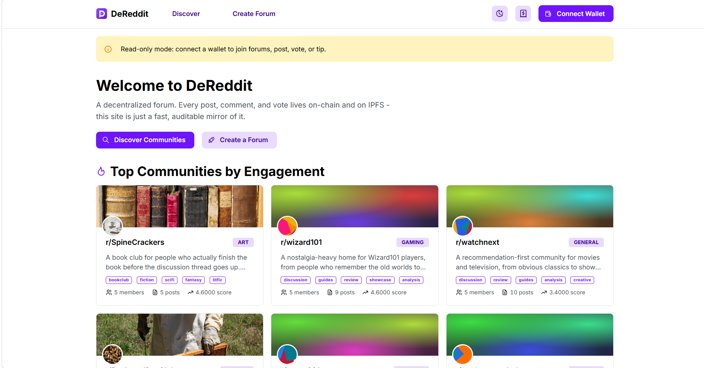
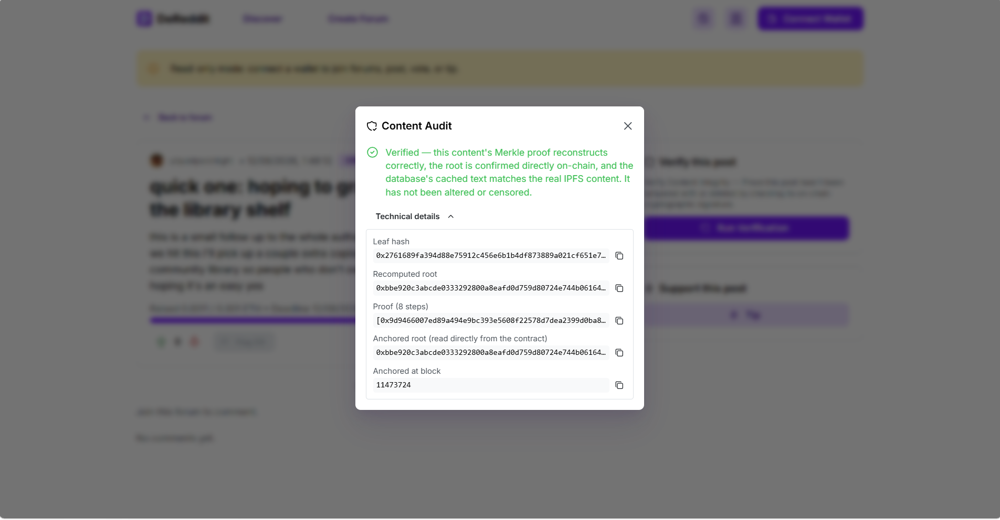

# DeReddit: a decentralized, anti-censorship community platform with on-chain Merkle proof anchoring

DeReddit is a Reddit-like decentralized application built on Ethereum-compatible smart contracts, IPFS (Kubo) for content storage, a TypeScript event-indexing backend, and a React/Mantine web application.

The dApp contracts are the source of truth: identity, membership, posts, comments, votes, flags, polls, tips, crowdfunds, and Merkle root anchors all live on-chain. Large text content, metadata, and media references are stored as JSON blobs on IPFS; only `bytes32` CID digests and critical state ever touch the chain. An Event Indexer mirrors on-chain events into PostgreSQL for fast reads, and an API Server exposes that data through a REST API. The web application reads from that API and writes directly to the contracts through a wallet application such as MetaMask.

Reads feel like an ordinary Web2 app. But every post, comment, and forum can still be checked against a Merkle root the Event Indexer's oracle wallet anchored on-chain, so nothing the API returns has to be taken on faith.

---

## Key features

- One wallet, one immutable username, and IPFS-hosted profile data, with the ability to join and leave forums freely.
- A three-level Merkle audit system: forum-post subtrees, post-comment subtrees, and a top-level tree anchored on-chain every block.
- Time Capsule posts, whose content stays hidden until a timestamp the author sets.
- Poll posts with author-configured options and deadlines, tallied on-chain.
- Crowdfund posts: goal-based ETH campaigns with contribution tracking, creator payout, and backer refunds if the goal isn't met.
- Threaded comments capped at three tiers deep (`MAX_COMMENT_DEPTH = 3` on-chain, mirrored in the UI).
- A "Magic Marker" vote model: votes are tracked as `1`, `-1`, `-2`, or `0`, and a karma floor at zero stops downvotes from pushing an author's karma negative.
- Weighted flagging, where flag impact scales from 1 to 5 depending on the flagger's karma relative to the forum's threshold.
- Native ETH tipping to post authors, comment authors, or any address.
- Event-driven indexing: each block is indexed atomically, with per-event savepoints so one bad event doesn't take down the whole block.
- A React 19 web application built with Mantine (`@mantine/core`), not Tailwind.
- Client-side Merkle proof verification, so the app checks content against the on-chain anchored root instead of trusting the API.





---

## Guides

- [User Guide](./docs/USER_GUIDE.md): setup, installation, and day-to-day usage.
- [Developer Guide](./docs/DEVELOPER_GUIDE.md): architecture, API catalog, and testing.

---

## Quick start

Access the [live demo](https://pregram.github.io/DeReddit/) for simplicity. **Note:** The DeReddit server may not be available.

Run the fully local development stack:

```bash
./run.sh local-hardhat
```

This launches a local Hardhat chain, local PostgreSQL, Kubo IPFS, contract deployment, the Event Indexer, the API Server, and the Vite web application. Once it's up, the app is available at:

```text
http://localhost:5173
```

See the User Guide for full prerequisites and configuration details.

---

## Open source and IP compliance

To the best of the team's knowledge, all third-party assets and code used in this project are open-source or permissively licensed. The project relies on Hardhat, ethers.js, Solidity, React, Vite, Mantine, Express, PostgreSQL, `pg`, Kubo IPFS, `merkletreejs`, `zod`, Jest, Vitest, and Playwright.

No proprietary third-party logos, icons, fonts, or closed-source code were intentionally included. Where third-party open-source code is used, its license terms and attribution requirements are respected. If any license uncertainty remains, the repository should stay private to avoid legal exposure.
