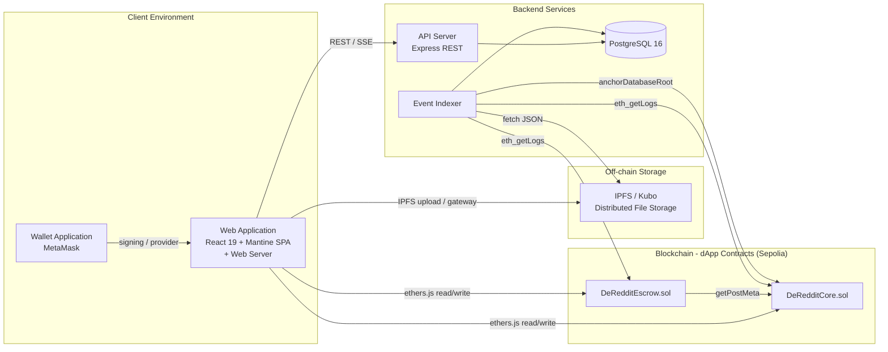
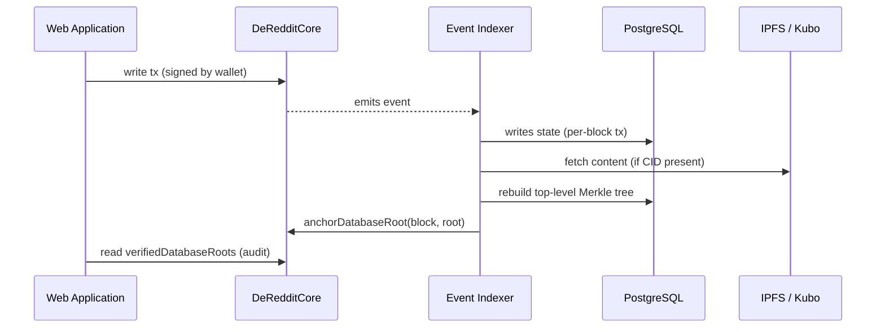

# DeReddit Developer Guide

This guide covers the high-level architecture, module organization, Merkle anchoring system, dApp contracts, backend database and API catalog, build tools, and a testing suite.

---

## 1. High-level system architecture

DeReddit is a three-component monorepo:

1. **Blockchain - dApp contracts.** `DeRedditCore.sol` and `DeRedditEscrow.sol` are the source of truth for identity, membership, posts, comments, votes, flags, tips, polls, crowdfunds, and Merkle root anchors.
2. **Backend services: an Event Indexer and an API Server.** The Event Indexer polls blockchain event logs, mirrors on-chain state into PostgreSQL, fetches content from IPFS, runs badge checks, and anchors a Merkle root on-chain once per processed block once it's caught up. The API Server exposes that indexed data through a read-optimized REST API.
3. **Web Application.** A React 19 + Mantine single-page application that reads from the API Server and writes directly to the dApp contracts through a wallet application such as MetaMask.

The Event Indexer parses `DeRedditCore` and `DeRedditEscrow` logs together, merge-sorts them by log index, and applies all resulting database writes for a block inside a single PostgreSQL transaction. A per-event `SAVEPOINT` means one malformed event gets logged to `indexer_errors` and skipped, instead of aborting the entire block.

### Architecture diagram



**Terminology note:**
- Web Application: the browser SPA and the HTTP web server that serves it.
- Wallet Application: the local browser extension (for example, MetaMask) used to sign transactions.
- Event Indexer: the process that ingests blockchain events and mirrors state.
- API Server: the Express HTTP server that exposes read endpoints.
- IPFS / Kubo: the off-chain distributed file storage layer.
- dApp Contracts: the on-chain smart contracts deployed on Sepolia.

---

## 2. Directory and module structure

| Path | Core responsibilities |
|---|---|
| `contracts/` | Solidity dApp contracts: `DeRedditCore.sol`, `DeRedditEscrow.sol`. Types & Errors: `DeRedditTypes.sol`; test harness `contracts/test/FlagImpactHarness.sol` |
| `backend/` | Express API Server, Event Indexer, PostgreSQL init script, Merkle tree builder, badge engine, Zod event validation, Jest tests |
| `frontend/` | React 19 Web Application: pages, components, contexts, library modules, Vitest unit tests, Playwright E2E specs |
| `scripts/` | Deployment scripts such as `deploy.ts` and ABI synchronization via `copy-abis.js` |
| `test/` | Hardhat integration tests (`DeRedditTest.ts`) |
| root shell scripts | `run.sh`, `run-local-hardhat.sh`, `run-local-sepolia.sh`, `run-public-sepolia.sh`, `env-lib.sh` for orchestration |

Two files are generated rather than hand-written:

- `frontend/src/lib/abi.ts`
- `backend/src/abis.ts`

Both come from `scripts/copy-abis.js`, are marked `DO NOT EDIT MANUALLY`, and need to be regenerated after any Solidity ABI change.

### Module breakdown

#### 2.1. Smart (dApp) Contracts Module (`contracts/`)
On-chain source of truth for identity, forums, posts, comments, votes, flags, tips, polls, crowdfunds, and Merkle root anchoring.

* **`DeRedditCore.sol`**: The primary smart contract ledger. Manages identities (`registerIdentity`), forums (`createForum`), posts (`createPost`), comments (`createComment`), vote accounting (`votePost`), logarithmic flagging (`flagPost`), and state anchoring (`anchorDatabaseRoot`).
* **`DeRedditEscrow.sol`**: A standalone campaign escrow contract that interacts with `DeRedditCore` via the `IDeRedditCore` interface to let post creators launch crowdfunds (`launchCrowdfund`), collect contributions (`contribute`), and execute claims or refunds (`claimPayout`, `claimRefund`).
* **`DeRedditTypes.sol`**: Centralized definitions for Solidity enums (`PostType`) and domain custom errors (e.g., `TimeCapsuleLocked`, `AlreadyRegistered`).
* **`contracts/test/FlagImpactHarness.sol`**: A helper contract exposing the internal logarithmic flag calculation logic (`_calculateFlagImpact`) for direct testing.

For a deep dive into functions, structs, and errors, see [4. Smart contracts specification](#4-smart-contracts-specification).

#### 2.2. Backend Infrastructure Module (`backend/`)

* **Event Indexer (`src/indexer.ts`)**: Synchronizes on-chain dApp contract state into PostgreSQL. Each poll cycle:
  - Pulls `eth_getLogs` for both `DeRedditCore` and `DeRedditEscrow`, merge-sorted by log index.
  - Validates every event payload against a Zod tuple schema.
  - Fetches IPFS content when an event carries a CID, and runs badge checks inline.
  - Applies each block's writes inside a single PostgreSQL transaction, with a per-event `SAVEPOINT` so a malformed event gets logged to `indexer_errors` and skipped instead of aborting the whole block.
  - Anchors the Merkle root on-chain once it's caught up to the chain tip.
* **API Server (`src/server.ts`)**: A read-optimized Express REST API over the indexed PostgreSQL data. It configures CORS/JSON middleware, exposes `/health`, and mounts routes for users, forums, posts, comments, search, audit proofs, badges, and notifications - including an SSE stream for live notifications. It never listens to blockchain events or writes to PostgreSQL during normal request handling; it only reads what the Event Indexer has already produced.
* **Merkle Tree Engine (`src/merkle.ts`)**: Builds a three-tier Merkle tree - forum-posts subtrees, post-comments subtrees, and one top-level root - from database state, and assembles the audit proofs served by the API Server. Full anchoring and verification flow covered later in this section.
* **Badge Engine (`badges.ts`)**: Checks user activity (karma, posts, comments, tips) against 25 badge definitions and awards them during block indexing.
* **Database Schema (`init.sql`)**: The PostgreSQL 16 schema, applied automatically on first database container boot - 19 tables plus one computed view (`v_forums_by_score`). Covers mirrored on-chain state, derived vote/flag mirrors, tips, badge definitions, notifications, indexer state, and Merkle anchors, plus full-text (`fts_document`) and `pg_trgm` fuzzy-search indexes.

For the complete PostgreSQL schema and API catalog, see [5. Backend database and API catalog](#5-backend-database-and-api-catalog).

#### 2.3. Web Application Module (`frontend/`)
* **State & Wallet Contexts (`src/context/`)**: `WalletContext.tsx` connects to the Wallet Application, tracks the active address/signer, and pulls the matching backend profile once the indexer has seen that wallet. `TransactionContext.tsx` tracks pending/confirmed state for in-flight transactions and drives the global transaction tray.
* **Library Helpers (`src/lib/`)**:
  - `contracts.ts`: memoized hooks that hand back a stable, signer-bound contract instance.
  - `ipfs.ts`: JSON and file uploads and retrieval against the IPFS / Kubo gateway.
  - `merkleVerify.ts`: pure client-side cryptographic proof verification, validating off-chain database responses directly against the on-chain contract state root.
  - `api.ts`: centralized, strongly typed HTTP client for the API Server.
* **UI Pages & Components (`src/pages/`, `src/components/`)**: Route-level pages - Home, Forum Discovery, Forum Hub, Create Forum, Create Post, Post Detail, and User Profile - plus shared Mantine components such as `MerkleAuditModal.tsx` for proof verification, and the poll/crowdfund setup forms (`PollSetupForm.tsx`, `CrowdfundSetupForm.tsx`) used inside the post creation and detail flows.

---

## 3. General Data Flow & Module Interactions

How the main modules interact during normal operation, grouped by phase:

### 3.1 Request lifecycle

**Connect & read**
1. The **Wallet Application** (MetaMask) connects to the **Web Application**.
2. The **Web Application** requests data from the **API Server** over REST/SSE; the **API Server** queries **PostgreSQL** and returns JSON.

**Write & confirm**
3. The **Web Application** builds a transaction with `ethers.js` and sends it to the **dApp Contracts**; the **Wallet Application** signs it.
4. The **dApp Contracts** execute the transaction and emit events.

**Index & anchor**
5. The **Event Indexer** polls `eth_getLogs` from both contracts, validates events with Zod, merge-sorts them by log index, and writes the resulting state to **PostgreSQL** inside a per-block transaction.
6. When an event carries a CID, the **Event Indexer** fetches the JSON from **IPFS / Kubo** and decodes it into the database.
7. Badge checks run inline, inside the same transaction as the triggering event.
8. Once caught up to the chain tip, the **Event Indexer** rebuilds the top-level Merkle tree and, if the root changed, calls `DeRedditCore.anchorDatabaseRoot(blockNumber, merkleRoot)` using the oracle wallet.

**Serve & verify**
9. The **API Server** keeps serving the updated PostgreSQL state to the **Web Application**.
10. On request, the **Web Application** fetches an audit proof from the **API Server**, recomputes the leaf hash locally, walks the proof, and independently reads the anchored root from `DeRedditCore.verifiedDatabaseRoots` to confirm it.



### 3.2 Merkle anchoring deep dive

DeReddit anchors a Merkle root of its off-chain database state on-chain once per block, so any post, comment, or forum can be cryptographically verified against a root the dApp contracts have attested to.

#### Tree structure

Implemented in `backend/src/merkle.ts` as one three-level tree, not three separate flat trees - subtree roots are folded directly into the top-level tree as raw leaves, without additional hashing.

| Level | Description |
|---|---|
| **Forum-posts subtrees** | One tree per forum; each leaf is a post in that forum. `null` if the forum has no posts. |
| **Post-comments subtrees** | One tree per post; each leaf is a comment on that post. `null` if the post has no comments. |
| **Top-level tree** | Leaves: one per forum, plus every non-empty forum-posts subtree root, plus every non-empty post-comments subtree root. A zero buffer is used as the sole leaf if none of the above exist. |

#### Leaf composition

```text
keccak256(
  solidityPacked(
    ["string", "uint256", "bytes32"],
    [entityType, id, contentHash]
  )
)
```

- `entityType`: `"post"`, `"comment"`, or `"forum"`.
- `id`: the on-chain numeric ID, or for forums, the forum key cast to `uint256`.
- `contentHash`: the entity's `bytes32` IPFS CID digest.

All trees use `MerkleTree` from `merkletreejs`, `ethers.keccak256` as the hash function, and `sortPairs: true`.

#### Build and anchor flow

In `backend/src/indexer.ts`, once per block or batch:

1. Rebuild the full top-level tree from current PostgreSQL state - only once caught up to the chain tip, not during batch catch-up.
2. Compare the new root against `lastSentAnchorRoot` and the `merkle_anchors` table to avoid duplicate anchors.
3. If the root changed, call `DeRedditCore.anchorDatabaseRoot(blockNumber, merkleRoot)` using the oracle wallet configured by `ORACLE_PRIVATE_KEY`.

#### On-chain anchoring functions

| Function | Signature | Behavior |
|---|---|---|
| storage | `mapping(uint256 => bytes32) public verifiedDatabaseRoots` | Block number → anchored Merkle root |
| `anchorDatabaseRoot` | `anchorDatabaseRoot(uint256 blockNumber, bytes32 merkleRoot) external onlyOracle` | Writes the mapping, emits `DatabaseRootAnchored` |
| `getDatabaseRoot` | `getDatabaseRoot(uint256 blockNumber) external view returns (bytes32)` | Returns the anchored root, or zero if none exists for that block |

#### Verification workflow

API Server audit routes:

| Route | Returns |
|---|---|
| `GET /api/audit/posts/:postId` | `{root, proof, leaf}` |
| `GET /api/audit/comments/:commentId` | `{root, proof, leaf}` |
| `GET /api/audit/forums/:forumKey` | `{root, proof, leaf}` |
| `GET /api/merkle/anchor` | `{lastAnchoredRoot, lastAnchoredBlock, anchored_at}` |

Proof shape by entity type:
- **Post**: within-forum-posts-subtree proof, concatenated with the subtree-to-top proof.
- **Comment**: within-post-comments-subtree proof, concatenated with the subtree-to-top proof.
- **Forum**: single-level proof directly against the top-level tree.

Client-side logic lives in `frontend/src/lib/merkleVerify.ts` and `frontend/src/components/MerkleAuditModal.tsx`:

1. Fetch `{root, proof, leaf}` from the API Server audit route.
2. Recompute the leaf hash from the currently displayed content.
3. Walk the proof against the API-returned root.
4. Read the on-chain anchored root directly from the dApp contract using a read-only provider.
5. Fetch the content from IPFS and compare it to the API-returned content - on a mismatch, surface the verified content via a callback so the page can display the corrected version.
6. Show pass/fail/corrected status plus the full proof path.

Because the on-chain root is read independently at step 4, users never have to trust the API Server's own claims.

---

## 4. Smart contracts specification

All dApp contracts are written in Solidity `^0.8.28`.

### `DeRedditTypes.sol`

Defines shared enums and custom errors.

Enum:

```solidity
enum PostType { Standard, TimeCapsule, Poll, Crowdfund }
```

Custom errors are grouped by domain, including:

- Identity: `AlreadyRegistered`, `UsernameTaken`, `InvalidUsername`, `NotRegistered`
- Forum: `ForumAlreadyExists`, `ForumNotFound`, `InvalidHandle`, `AlreadyMember`, `NotMember`
- Post/comment: `PostNotFound`, `CommentNotFound`, `TimeCapsuleLocked`, `NotPostAuthor`, `DepthExceeded`, `InvalidTimeCapsule`, `CommentPostMismatch`
- Voting: `InvalidDirection`, `SameVote`, `CannotVoteOwnContent`
- Flagging: `FlaggingNotActive`, `AlreadyFlagged`
- Poll: `NotPoll`, `PollNotConfigured`, `PollAlreadyConfigured`, `PollOptionOutOfRange`, `SameVotePoll`, `PollExpired`
- Crowdfund: `NotCrowdfund`, `CrowdfundAlreadyLaunched`, `NotCampaignCreator`, `CampaignStillActive`, `CampaignEnded`, `GoalNotReached`, `GoalAlreadyReached`, `AlreadyClaimed`, `NothingToRefund`, `InvalidGoal`, `InvalidDuration`
- Financial/misc: `InvalidAmount`, `TransferFailed`, `ZeroAddress`, `Unauthorized`, `Reentrancy`

### `DeRedditCore.sol`

The core dApp contract, responsible for identity, forums, posts, comments, votes, flags, tips, polls, and Merkle anchoring.

#### Constants

| Constant | Value | Notes |
|---|---|---|
| `MAX_FLAG_WEIGHT` | `5` | Documentation ceiling; the ladder hardcodes weights 1 to 5 |
| `MAX_COMMENT_DEPTH` | `3` | Maximum comment nesting depth |
| `MAX_POLL_OPTIONS` | `100` | Maximum poll option count |

#### Key structs

| Struct | Fields |
|---|---|
| `Forum` | `uint64 minKarmaToFlag`, `bool initialized` |
| `UserProfile` | `uint64 karma`, `bytes32 username` |
| `Post` | `address author`, `PostType postType`, `uint32 visibleAfter`, `uint32 upvotes`, `uint32 downvotes`, `uint32 flagTally`, `uint8 pollOptionCount`, `uint32 pollDeadline`, `bytes32 forumKey` |
| `Comment` | `address author`, `uint8 tier`, `uint32 upvotes`, `uint32 downvotes`, `uint32 flagTally`, `uint256 parentId`, `uint256 postId` |

`pollOptionCount == 0` means a Poll post hasn't yet completed the `configurePoll` step.

#### Key mappings

- `usernameExists`
- `users`: wallet to `UserProfile`
- `forumMembership`: forum key to member to bool
- `postVoteState` / `commentVoteState`: ID to voter to `int8` Magic Marker state
- `postFlagState` / `commentFlagState`: one flag per wallet per item
- `pollOptionVotes`: poll option tally
- `userPollChoice`: poll voter choice
- `verifiedDatabaseRoots`: block number to Merkle root

#### Main functions

| Function | Purpose |
|---|---|
| `registerIdentity(bytes32 username, bytes32 profileCID)` | One-time username registration |
| `updateProfileCID(bytes32 profileCID)` | Update profile IPFS pointer |
| `createForum(bytes32 forumKey, uint64 minKarmaToFlag, bytes32 ipfsCID)` | Create forum and auto-join creator |
| `joinForum` / `leaveForum` | Membership management |
| `createPost(...)` | Step 1 of post creation |
| `configurePoll(...)` | Step 2 for Poll posts |
| `createComment(...)` | Create comment/reply with depth enforcement |
| `votePost` / `voteComment` | Vote, or change/clear a vote |
| `flagPost` / `flagComment` | Weighted flagging |
| `tipPostCreator` / `tipCommentCreator` / `tipDirect` | Native ETH tips |
| `castPollVote` | Poll voting |
| `anchorDatabaseRoot` | Oracle-only Merkle root anchoring |

#### Magic Marker vote model

Vote state values:

| State | Meaning |
|---|---|
| `1` | Upvoted |
| `-1` | Effective downvote |
| `-2` | Swallowed downvote |
| `0` | Cleared |

`_calculateVoteDelta` first undoes the previous vote's effect, then applies the new vote. If a downvote would drop the author's karma below zero, it becomes a swallowed downvote (`-2`) instead, and karma isn't decremented.

#### Flag weight ladder

`_calculateFlagImpact` returns a logarithmic weight from 1 to 5 based on karma and the forum's `minKarmaToFlag`. If `minKarmaToFlag == 0`, a base of `1` is used to avoid dividing by zero.

### `DeRedditEscrow.sol`

Handles the crowdfund lifecycle. It calls back into `DeRedditCore.getPostMeta` through the `IDeRedditCore` interface to verify that the caller owns a `Crowdfund`-type post before allowing a campaign launch.

#### Crowdfund struct

```solidity
struct Crowdfund {
    address creator;
    uint32 deadline;
    bool claimed;
    uint256 targetGoal;
    uint256 fundsRaised;
}
```

A `creator == address(0)` value means the campaign hasn't been launched.

#### Functions

| Function | Purpose |
|---|---|
| `launchCrowdfund(postId, targetGoal, duration)` | Step 2 for Crowdfund posts; author-only |
| `contribute(postId)` | Accept ETH contribution before deadline |
| `claimPayout(postId)` | Creator claims funds if deadline passed and goal met |
| `claimRefund(postId)` | Backer claims refund if deadline passed and goal unmet |
| `getCampaign(postId)` | View campaign state |

### `FlagImpactHarness.sol`

A test-only wrapper inside `contracts/test/`. It exposes the internal `_calculateFlagImpact` function for direct boundary testing. It isn't deployed as part of production infrastructure.

---

## 5. Backend database and API catalog

### PostgreSQL schema overview

The database consists of 19 tables/views, applied automatically by `backend/init.sql` on first PostgreSQL container boot. The schema is organized into:

- Identity and forum data: users, forums, forum tags, forum memberships.
- Content data: posts, poll options, poll votes, crowdfund contributions, comments.
- Derived state: vote mirrors, flag mirrors, tips, badge definitions, user badges, notifications.
- Event Indexer/system data: indexer state, Merkle anchors, indexer errors.
- View: `v_forums_by_score`, a computed forum ranking view.

Important characteristics:

- All entity IDs are handled as `bigint` or string-serialized bigints end-to-end.
- On-chain `bytes32` CID digests are stored for `profile_cid`, `ipfs_cid`, etc.
- `media_cids`, `icon_cid`, and `banner_cid` are plain CIDv0 strings nested inside IPFS metadata JSON.
- Full-text search uses `forums.fts_document` plus `pg_trgm` for fuzzy forum names and post titles.
- `UNCONFIGURED_FILTER` excludes unconfigured Poll/Crowdfund posts from forum feeds.

### API Server route catalog

All routes are read-only except the notification mutation routes noted below.

#### Health

| Route | Description |
|---|---|
| `GET /health` | Service health status; returns 503 if the DB is unreachable |

#### Users

| Route | Description |
|---|---|
| `GET /api/users/:wallet` | Full user profile, badges, and forums |
| `GET /api/users/:wallet/posts` | Up to 50 recent posts |
| `GET /api/users/:wallet/comments` | Up to 50 recent comments |
| `GET /api/users/:wallet/contributions` | Recent crowdfund contributions |
| `GET /api/users/:wallet/tips-received?from=<wallet>` | Total wei tipped from one wallet to this wallet |

#### Forums

| Route | Description |
|---|---|
| `GET /api/forums` | Paginated forum list with search/category/tag/sort filters |
| `GET /api/forums/tags?q=` | Tag autocomplete |
| `GET /api/forums/recommended?wallet=` | Score-based and tag-overlap recommendations |
| `GET /api/forums/:forumKey?wallet=` | Single forum detail with membership |

#### Posts

| Route | Description |
|---|---|
| `GET /api/forums/:forumKey/posts` | Paginated post feed, excludes unconfigured posts |
| `GET /api/posts/:postId?userWallet=` | Single post detail, includes poll options/user contribution |

#### Comments

| Route | Description |
|---|---|
| `GET /api/posts/:postId/comments` | Paginated by root tier-1 comment; each page returns the full descendant subtree |

#### Audit / Merkle

| Route | Description |
|---|---|
| `GET /api/audit/posts/:postId` | Returns a Merkle proof for a post |
| `GET /api/audit/comments/:commentId` | Returns a Merkle proof for a comment |
| `GET /api/audit/forums/:forumKey` | Returns a Merkle proof for a forum |
| `GET /api/merkle/anchor` | Most recent anchored root/block |

#### Search

| Route | Description |
|---|---|
| `GET /api/search/forums?q=&category=&tag=` | Full-text + trigram forum search |

#### Notifications

| Route | Description |
|---|---|
| `GET /api/notifications/:wallet` | Paginated notification list + unread count |
| `GET /api/notifications/:wallet/stream` | SSE stream for new notifications |
| `PATCH /api/notifications/:wallet/read-all` | Mark all read; requires signature auth |
| `DELETE /api/notifications/:wallet` | Clear all notifications; requires signature auth |
| `PATCH /api/notifications/:wallet/:notificationId/read` | Mark one read; requires signature auth |

Notification mutation routes require:

- `X-Wallet-Signature` header
- `X-Wallet-Timestamp` header

The signed message is:

```text
DeReddit notifications access for <wallet> at <issuedAt>
```

The timestamp must be within a 10-minute window.

#### Badges

| Route | Description |
|---|---|
| `GET /api/badges` | All 25 badge definitions grouped by category |

---

## 6. Build tools and technology stack

| Layer | Technology |
|---|---|
| dApp contracts | Solidity `^0.8.28`, Hardhat 3, Foundry-style Solidity tests, Mocha/Chai/ethers |
| Backend services | Node.js, TypeScript, Express, PostgreSQL 16, `pg`, `ethers` v6, `zod`, `merkletreejs` |
| Web Application | React 19, Vite, Mantine (`@mantine/core`), `react-router-dom`, `ethers` v6, wallet application (MetaMask) |
| Off-chain storage | IPFS / Kubo daemon; all content stored as IPFS JSON blobs |
| DevOps & Infrastructure | Docker, Docker Compose, Bash |

Key Web Application library modules:

- `lib/api.ts`: typed fetch wrapper for API Server routes.
- `lib/contracts.ts`: memoized signer-bound contract hooks.
- `lib/env.ts`: fail-fast environment validation.
- `lib/hash.ts`: CID to bytes32 conversion and forum key derivation.
- `lib/ipfs.ts`: IPFS upload, fetch, and gateway URL functions.
- `lib/merkleVerify.ts`: client-side Merkle proof verification.
- `lib/notificationAuth.ts`: notification mutation signing helper.
- `lib/useNotificationStream.tsx`: SSE notification client hook.

---

## 7. Testing guide

The repository uses a multi-layer test suite.

### Unified test runner

```bash
npm test
```

Runs:

```bash
npm run test:contracts
npm run test:backend
npm run test:frontend
```

### Contract integration tests

```bash
npm run test:contracts
```

- Framework: Hardhat 3 with Mocha/Chai/ethers
- Location: `test/DeRedditTest.ts`
- Coverage: 192 `it()` cases across 15 `describe()` blocks
- Includes identity, forums, posts, comments, polls, voting, flagging, tipping, and escrow

There's also a Solidity test harness:

```text
contracts/test/FlagImpactHarness.sol
```

### Backend API Server and Event Indexer tests

```bash
npm run test:backend
```

- Framework: Jest with `--runInBand`
- Location: `backend/test/*.test.ts`
- Five test files:
  - `api.forums.test.ts`
  - `api.notifications.test.ts`
  - `api.posts.test.ts`
  - `api.users.test.ts`
  - `indexer.test.ts`
- Shared fixtures and setup in `fixtures.ts`, `globalSetup.ts`, `setupAfterEnv.ts`, `env.ts`

### Web Application unit tests

```bash
npm run test:frontend
```

- Framework: Vitest
- Location: `frontend/src/**/__tests__/*.test.ts(x)`
- Five test files:
  - `lib/__tests__/gradientMesh.test.ts`
  - `context/__tests__/TransactionContext.test.tsx`
  - `context/__tests__/WalletContext.test.tsx`
  - `components/__tests__/ForumIcon.test.tsx`
  - `components/__tests__/UserAvatar.test.tsx`

### Web Application end-to-end tests

```bash
npm run test:e2e
```

- Framework: Playwright
- Location: `frontend/e2e/*.spec.ts`
- Three specs:
  - `forum.spec.ts`
  - `post.spec.ts`
  - `profile.spec.ts`
- Shared fixtures and wallet mocking in `fixtures.ts` and `mockWallet.ts`

This command isn't included in the default `npm test` chain.

### Compilation

```bash
npm run compile
```

Runs:

```bash
npx hardhat compile
node scripts/copy-abis.js
```

This regenerates the ABI files used by the Web Application and backend services.

